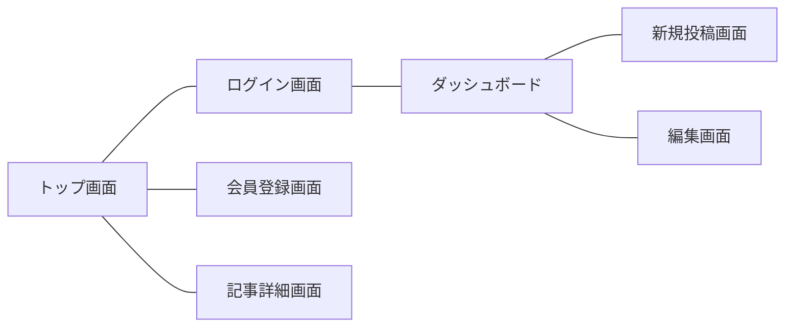

# 基本設計書：認証機能付きブログシステム

## 1. システム概要

本システムは、ユーザーが個別にアカウントを持ち、記事の作成・管理を行うことができるブログプラットフォームです。

### 1.1 開発の目的

- ユーザーごとの記事管理（投稿・編集・削除）の実現
- 認証によるセキュリティの確保
- Docker 環境を利用したポータビリティの高い開発基盤の構築

### 1.2 システム構成図

本システムは以下の技術スタックで構成されます。

- **Frontend**: Blade (Laravel Template Engine), Tailwind CSS
- **Backend**: PHP 8.x (Laravel 12)
- **Infrastructure**: Docker Compose (App, DB)
- **Database**: MySQL 8.0

---

## 2. 機能設計（Function List）

ユーザーが利用できる機能の全リストです。

| 機能 ID | 大項目       | 中項目         | 機能概要                               | 権限       |
| :------ | :----------- | :------------- | :------------------------------------- | :--------- |
| F-01    | 認証         | 会員登録       | 新規アカウントを作成する               | 全員       |
| F-02    | 認証         | ログイン       | 登録済みのメール・パスワードで認証する | 全員       |
| F-03    | 記事管理     | 記事一覧表示   | 全ユーザーの投稿を新着順に表示する     | 全員       |
| F-04    | 記事管理     | 記事詳細表示   | 指定した記事の本文を表示する           | 全員       |
| F-05    | 記事管理     | 新規投稿       | タイトル・本文を入力して保存する       | ログイン中 |
| F-06    | 記事管理     | 投稿編集       | 自分の投稿内容を修正する               | 本人のみ   |
| F-07    | 記事管理     | 投稿削除       | 自分の投稿を削除する                   | 本人のみ   |
| F-08    | ユーザー管理 | ダッシュボード | 自分の投稿履歴を表示する               | ログイン中 |

---

## 3. 画面設計（UI Design）

画面の遷移と構成を定義します。

### 3.1 画面遷移図

### 3.2 画面一覧

各画面の役割、アクセス制限（権限）、および主要な機能項目を整理します。

| 画面 ID  | 画面名             | パス (URL)         | アクセス権限         | 主要な表示・操作項目                       |
| :------- | :----------------- | :----------------- | :------------------- | :----------------------------------------- |
| **P-01** | **トップ画面**     | `/`                | ゲスト・会員         | 全記事一覧、ログイン・登録ボタン           |
| **P-02** | **ログイン**       | `/login`           | ゲスト               | メールアドレス・パスワード入力フォーム     |
| **P-03** | **会員登録**       | `/register`        | ゲスト               | 名前・メール・パスワード登録フォーム       |
| **P-04** | **ダッシュボード** | `/dashboard`       | **ログイン会員のみ** | 自分の記事リスト、新規投稿ボタン           |
| **P-05** | **記事詳細**       | `/posts/{id}`      | ゲスト・会員         | 本文表示、(本人のみ)編集・削除ボタン       |
| **P-06** | **記事作成**       | `/posts/create`    | **ログイン会員のみ** | 投稿タイトル・本文入力フォーム、保存ボタン |
| **P-07** | **記事編集**       | `/posts/{id}/edit` | **投稿者本人のみ**   | 既存内容の修正フォーム、更新ボタン         |

---

## 5. 非機能要件・セキュリティ

開発・運用において、システムの安全性と品質を担保するための要件を定義します。

### 5.1 セキュリティ対策

実務レベルの攻撃耐性を備えるため、以下の機能を実装します。

| 対策項目         | 内容                                           | 実装方法                                                |
| :--------------- | :--------------------------------------------- | :------------------------------------------------------ |
| **認証管理**     | 不正なログインを防止し、セッションを安全に管理 | Laravel Breeze (標準) による堅牢な認証基盤              |
| **アクセス制限** | 他人の記事の編集・削除を防止                   | Controller および Policy による権限認可 (Authorization) |
| **CSRF 対策**    | 第三者による不正なリクエスト送信を防止         | Laravel 標準の CSRF 保護トークンを全フォームに適用      |
| **XSS 対策**     | 悪意のあるスクリプトの実行を防止               | Blade テンプレートの自動エスケープ機能を活用            |
| **SQL 注入対策** | データベースへの不正操作を防止                 | Eloquent ORM（クエリビルダ）によるプレースホルダ利用    |

### 5.2 非機能要件（品質・運用）

開発のしやすさと、将来的な拡張性を考慮した設計方針です。

- [ ] **バリデーション (Validation)**
  - 全ての入力フォームにおいて、未入力や文字数制限などのチェックを行い、適切なエラーメッセージを表示します。
- [ ] **エラーハンドリング**
  - 存在しない記事（404 エラー）などに対し、ユーザーを迷わせない専用のエラーページを用意します。
- [ ] **CI (継続的インテグレーション)**
  - GitHub Actions を活用し、コードをプッシュするたびに自動テスト（PHPUnit）を実行。バグの混入を未然に防ぎます。
- [ ] **開発環境のポータビリティ**
  - Docker コンテナを利用し、OS 環境に依存せず、誰でも `docker compose up` だけで同じ開発環境を構築できるようにします。

> [!IMPORTANT] > **個人情報の取り扱いについて**
> パスワードはプレーンテキストではなく、必ず強力なアルゴリズム（Argon2 等）でハッシュ化して保存します。
